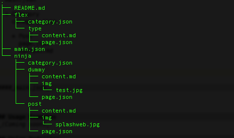

# viperfish

Node/Github Database-less Markdown Blogging System

__Alpha v0.4.0__

_Use with discretion!_

Viperfish is a simple blogging system that grabs content from a github repo.

It is currently in early alpha and, as such, its not particularly robust but if you follow the rules it'll work just
fine, as demonstrated by the [examples](#usage-examples "Viperfish in the wild").

Follow the getting started instructions to see it in action (I warn you though, the vanilla version won't be pretty, see
the [customisation](#customisation "Customising Viperfish") section).

To get started see the [getting started](#getting-started "Installing Viperfish") section of course!


## Getting Started

Install viperfish with npm,

```javascript
npm install viperfish
```

Create a start script to spark up viperfish,

```
touch index.js
```

Stick this in your start script,

```javascript
require('viperfish').start();
```

That's all you need to get started with viperfish!!  Simple no?

To see it in action (remember what I said early about prettiness?), use node to fire up the server,

```
node index
```

Then have a look at it with (default port is `3001`),

```
curl -X GET http://localhost:3001
```

or point your browser to

```
localhost:3001
```

Whilst this is all very functional the default content and theme is pretty boring, you'll be wanting to improve upon
that with some customisations.


## Customisation

### How Viperfish Works

Viperfish works by grabbing content from a github repo, passing it through a theme to style it and displaying it in
the browser.  In order to make viperfish work for you you'll need to create some [content](#creating-content "How to create content")
and you'll need to create a theme to display that content.

When viperfish is started there are a number of steps that it will perform to transparently initialise itself:

* [Github Authorisation](#github-authorisation)

* [Register custom configuration file](#custom-configuration-file)

* [Register custom templates](#custom-templates)

* [Register custom static files](#custom-static-files)

* [Register custom favicon](#custom-favicon)

### Github Authorisation

If you followed through the [Getting Started](#getting-started "Installing Viperfish") section then you probably noticed
that viperfish threw this log at you,

```
No github credentials in environment vars --- Unauthorised access to github --- max rate limit of 60 reqs per hour
```

Basic github authorisation is not required for public repositories and the default repo that viperfish pulls dummy
content from is public so it'll connect to github and get the content for you with no problems.  However, basic authorisation
is limited to 60 requests per hour.

In order to lift the 60 requests per hour limit you can register 2 environment variables that viperfish will use to
authenticate properly with github.

`GHusername` - the owner of the content repo

`GHpassword` - the password of the repo owner

(For an example of setting environment variables have a look at how to setup a [nodejitsu app](#using-nodejitsu))

### Custom Configuration File

The config file is an object that holds a number of different configuration options that Viperfish uses.

For the sake of completeness this is an example config file that sets all of the config options (these are actually the
default options, any of these options can be omitted from your config file and viperfish will use the defaults),

```javascript
var hljs = require( 'highlight.js' );
module.exports = {
    // Module Options
    moduleOpts: {
        nav         : [],
        port        : 3001,
        customPath  : '/public/',
        favicon     : 'favicon.png',
        logo        : 'logo.png'
    },

    // Template Options
    tmplOpts: {
        engine  : 'hogan',
        path    : './default/'
    },

    // GithubApi Config Options
    githubapi : {
        apiOpts : {
            version     : '3.0.0',
            timeout     : 5000
        },
        contentOpts : {
            user        : 'mattstyles',
            repo        : 'vpf-def',
            path        : null
        }
    },

    // Marked Config Options
    markedOpts : {
        gfm         : true,
        tables      : true,
        breaks      : false,
        pedantic    : false,
        sanitize    : false,
        smartLists  : true,
        langPrefix  : 'language-',
        highlight   : function ( code, lang ) {
            // Javascript highlighting
            if ( lang === 'javascript' ) {
              return hljs.highlight(lang, code).value;
            }
            return code;
        }
    }
};
```

You can see an example of a config file in the [github repo](https://github.com/mattstyles/viperfish/blob/master/config.js "config").

####_highlight.js_

The first line to require highlight.js is only required if you alter the markdown parser options later in the config
file.

####_Module Options_

This object holds the options for setting up the viperfish module.

`nav` - Array of navigation menu options if, for some reason, you want your navigation menu to differ from the options
found in your content repository's main.json (see [creating content](#creating-content "How to Create Content")).

`port` - The port to use when sparking up viperfish locally.

`customPath` - This is the directory that holds the theme files (such as css, js & templates).

`favicon` - The filename of the favicon to use, contained in the `/customPath/`.

`logo` - The logo that is associated with the website, some themes will require it, others not.

####_Template Options_

Viperfish uses the [Express](http://expressjs.com/ "Express") web application framework and supports templates to create
it's themes.

`engine` - The templating engine to use, currently only [hogan.js](http://twitter.github.com/hogan.js/ "Hulkamania Is Running Wild")
is supported.  Behind the scenes viperfish uses [consolidate.js](http://jsdoc.info/visionmedia/consolidate.js/ "Consolidate.js")
to push templates to the express view engine.

`path` - This is the path location of the templates, found within `moduleOpts.customPath/templates/`.

####_GithubApi Options_

To grab content from github repositories to use as content Viperfish uses [node-github](https://github.com/mikedeboer/node-github "Javascript GitHub API")
as a wrapper around the [Github API v3](http://developer.github.com/v3/ "GitHub API v3").

`apiOpts` - This contains the version of the api to wrap and a timer in milliseconds before the call to the api fails.

`contentOpts` - This is the primary means of pointing Viperfish to your content, enter the username and repository name and,
very importantly, leave `path` as `null` (it'll be over-written anyway but, to be sure, leave it in the config for now).

####_Marked Options_

Viperfish uses [Marked](https://github.com/chjj/marked "Markdown Parser") to parse the raw markdown data because Marked
is just so awesome!

There are various options and if you want to fiddle with them its best to read the info from the [Marked](https://github.com/chjj/marked "Markdown Parser") github repo.

### Custom Templates

This is where customising Viperfish gets really interesting.  Viperfish currently only supports [hogan.js](http://twitter.github.com/hogan.js/ "Hulkamania Is Running Wild")
templates but hogan is a versatile and powerful templating engine, if you haven't used hogan yet then read the hogan docs
for more info on how to use partials and the other features of the templating engine.  Templating is powerful, get using
it and get creative!

At the moment Viperfish isn't particularly sophisticated in it's template structure so when you create your own custom
template folder you'll need to create (or copy) each template into the folder (unlike the config options, viperfish won't
yet fall back to use default templates when it can't find one although this functionality is planned for the near
future).

Viperfish requires 7 basic templates but the content of those templates is not static so you can define how each template
works how you like - be aware though that Vipefish will be making calls to the templates but it is mostly just including
them so you could use them in different ways.  To see how they are included in Viperfish have a poke around in `lib/routes`.
I'll outline the basic functionality of each template in the default scheme, also check out the [examples](#usage-examples "Viperfish in the wild")
to see how other themes use the template system.

####_error.hjs_

The error template to display when an error occurs (usually this is an error collecting content from github but it will
potentially be other things).  It's due to be changed for a 404 template pretty soon.

####_main.hjs_

This is the main template that is called when displaying the opening page or a category page.  It is used to call in the
other partials - first the `header`, then the main body of the category listing from `listpost` and finally the `footer`.

####_header.hjs_

Sets up the opening HTML5 `<html>` tag, sorts out the `<head>` section, calls the `nav` template after opening the `<body>`.

####_nav.hjs_

Creates the main navigation menu.

####_listpost.hjs_

This template loops through items contained within the content meta file (see the [creating content](#creating-content "How to Create Content")
section) and displays them.

####_footer.hjs_

Displays the footer.

####_post.hjs_

The post template functions similarly to the main template in that it calls in partials for the `header` and `footer` but
in between it displays the main content of the post/page that has been grabbed from Github and parsed using Marked.

### Custom Static Files

The other half of customising Viperfish - those lovingly crafted CSS files that define the look and feel of your project
should be included in here.  Any images that your theme uses can also be included here, as should any javascript that
you want to use in your theme.

### Custom Favicon

Viperfish isn't limited to it's own favicon, place yours in the custom directory you set the filename in `config.moduleOpts`
and Viperfish will use that.

## Creating Content

Whilst the delivery mechanism (i.e. Viperfish) and a well designed theme are all important to a successful blog, a blog
is really all about the content that it uses.  One of the main principles behind Viperfish is that it should be as
simple to use as possible and allow writers to write.  To that end the bulk of content that Viperfish uses should be
written in [Markdown](http://daringfireball.net/projects/markdown/ "Daring Fireball | Markdown") with a few pieces of
JSON holding it all together.  At present this is not an automated process so you'll have to go through and carefully
create the JSON meta along with your posts but they are pretty small at the moment and don't do a lot—an automated tool
is in production that will take this step away and make it more user friendly.

Another key aspect of Viperfish is that it does not use a database.  This simplifies the delivery mechanism which is
already pretty lightning fast thanks to the power of Node's event loop.  Viperfish makes delivery of your blog fast and
that's good!

### Content Structure

Viperfish currently only supports content coming directly from a github repository (other storage methods are planned)
and an example of the directory structure can be found in the repository that Viperfish uses as it's [default](https://github.com/mattstyles/vpf-def "Viperfish default content repo")—
also see the [examples](#usage-examples "Viperfish in the wild") section.  If you followed through the [Getting Started](#getting-started "Installing Viperfish")
instructions then it should be fairly easy to work out how the information in the content repository maps into Viperfish.

At the moment Viperfish won't validate your content so any errors will just cause it to blow up, however, if you follow
the rules it's pretty simple to get it working for you.

The content structure for the dummy content repository looks like this,




####_README.md_

This is just for your own reference in the repo - Viperfish will ignore this.

####_main.json_

```json
{
  "nav": [
  	{ "item" : "ninja" },
  	{ "item" : "flex" }
  ],

  "recent": [
    {
      "post" : {
        "title"    : "Dummy Post Title",
        "loc"      : "/dummy/",
        "category" : "ninja",
        "date"     : "Tuesday 1st Jan 2013",
        "extract"  : "This is a short extract for a dummy post - welcome to Viperfish"
      }
    },
    {
      "post" : {
          "title"    : "A Post",
          "loc"      : "/post/",
          "category" : "ninja",
          "date"     : "Friday 1st Jan 2013",
          "extract"  : "This is another short post"
      }
    },
    {
      "post" : {
          "title"    : "Type test",
          "loc"      : "/type/",
          "category" : "flex",
          "date"     : "Friday 1st Jan 2013",
          "extract"  : "This is a post with various typographical elements and should be used to test styling for custom themes"
      }
    }
  ]
}
```

Main.json simply holds two objects.  `nav` contains a list of navigation menu items and `recent` holds a list of the
posts you want to display on the front page.

The `nav` items should correspond to the folders, which represent your different categories.

The `recent` list is a list of post objects that hold various meta about each post that you want to display.  Currently
there is no automated process for creating this file so you have to do it yourself but, for now, embrace the flexibility!!
It's fairly obvious to see how the meta maps on to the content - the important bit is the `loc` and `category` which
Viperfish uses to control it's URLs and push content to the client.  The `title`, `date` & `extract` don't need to map
to the content and you could use what you like here.

####_Categories & category.json_

Each sub-folder represents a category of posts.  Currently Viperfish only supports one level of nesting.  In the dummy
repo structure shown above those categories are `ninja` and `flex`.

The `category.json` file holds the meta for the category and is extremely similar to `main.json` and functionally
fulfills the same purpose.

```json
{
  "recent": [
      {
          "post" : {
              "title"    : "Type test",
              "loc"      : "/type/",
              "category" : "flex",
              "date"     : "Tuesday 1st Jan 2013",
              "extract"  : "This is a post with various typographical elements and should be used to test styling for custom themes"
          }
      }
  ]
}
```

It is simply a list of `recent` posts that you want to display.  Note that there is no restriction that you put _all_ of
the posts from a category into this file, you could, if you wanted, _hide_ some posts from the category listing.

Again, the important point to note here is the `loc` and `category` that Viperfish uses to route its URLs.

####_Posts - content.md & page.json_

The `page.json` simply holds a tiny amount of meta and (as of _v0.4.0_) is just a placeholder—it is not currently
referenced by Viperfish.

The real meat is in the content markdown file.

Viperfish uses [Marked](https://github.com/chjj/marked "Markdown Parser") to parse it's Markdown for presentation so any
of the options there are valid for Viperfish and can be set in the config.  This means you have access to [Github Flavoured Markdown](https://help.github.com/articles/github-flavored-markdown "Github Flavoured Markdown").

Any links, such as images, can be placed into a subfolder and referenced in the normal markdown style.  In the dummy
repo both `ninja/post` and `ninja/dummy` posts contain images.


## Usage Examples

To see Viperfish in action visit the [veryfizzyjelly](http://veryfizzyjelly.com "veryfizzyjelly") site.  It's all public
so if you want to root around in the custom theme then clone the repo on [github](https://github.com/mattstyles/vfj-blog "veryfizzyjelly github repo"),
the content structure can also be found on [github](https://github.com/mattstyles/vfj-content "veryfizzyjelly content github repo").

## Using Nodejitsu
_(Coming soon)_

## Documentation
_(Coming soon)_

## Release History

v0.4.0

* Minimal custom theme support
* Content delivery via [github](https://github.com/ "GitHub")
* [Markdown](http://daringfireball.net/projects/markdown/ "Daring Fireball | Markdown") support via [Marked](https://github.com/chjj/marked "Markdown Parser") - including [Github Flavoured Markdown](https://help.github.com/articles/github-flavored-markdown "Github Flavoured Markdown")!
* Usage examples - working example using [Nodejitsu](https://www.nodejitsu.com/ "Nodejitsu")
* Custom configuration options
* Install via [npm](https://npmjs.org/ "Node Package Manager")
* Templating via [Hogan](http://twitter.github.com/hogan.js/ "Hogan.js Templating Engine") and [Consolidate](http://jsdoc.info/visionmedia/consolidate.js/ "Consolidate.js")
* System runs on the [Express](http://expressjs.com/ "Express Web App Framework for Node") framework

## License
Copyright (c) 2013 Matt Styles  
Licensed under the MIT license.
